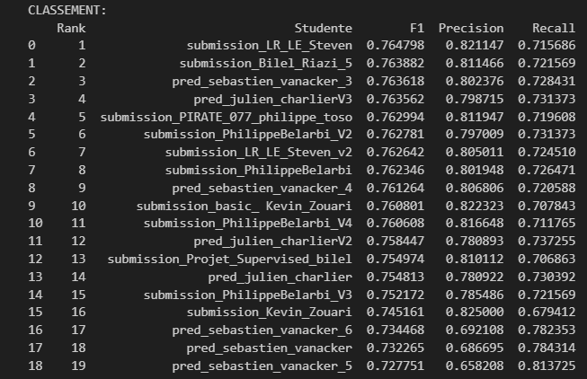

# Conversion Rate Challenge

Projet réalisé dans le cadre du bloc 3 de la certification CDSD (Jedha).

---

## Contexte

datascienceweekly.org cherche à comprendre ce qui pousse un visiteur à s'inscrire à sa newsletter. Le projet prend la forme d'un challenge Kaggle-like : prédire si un utilisateur va convertir (s'inscrire) à partir de ses caractéristiques (âge, pays, source de trafic, nombre de pages visitées...), avec le F1-score comme métrique de référence.

---

## Classement final

Classement des performances des modèles soumis par les étudiants durant la formation :



---

## Ce que j'ai fait

- EDA : analyse des distributions, taux de conversion par pays/source/type d'utilisateur
- Modélisation : plusieurs modèles testés (Régression Logistique, Random Forest, XGBoost), optimisation du F1-score
- Soumissions multiples au leaderboard (12 versions)
- Analyse des paramètres du meilleur modèle pour identifier des leviers d'action concrets

---

## Structure

```
Conversion_rate_challenge/
├── data/
│   ├── raw/               # Données brutes train/test (Jedha)
│   └── predictions/       # Fichiers de soumission au leaderboard (12 versions)
├── docs/
│   └── 02-Conversion_rate_challenge.ipynb   # Énoncé du projet
├── notebooks/
│   ├── conversion_rate.ipynb   # EDA
│   ├── model.ipynb             # Modélisation
│   ├── model_f1.ipynb          # Optimisation F1
│   └── model_propre.ipynb      # Version finale
└── README.md
```

---

## Stack

- Python — Pandas, Scikit-learn, Matplotlib, Seaborn

---

Julien CHARLIER — [(Github : Atomik31)](https://github.com/Atomik31)
